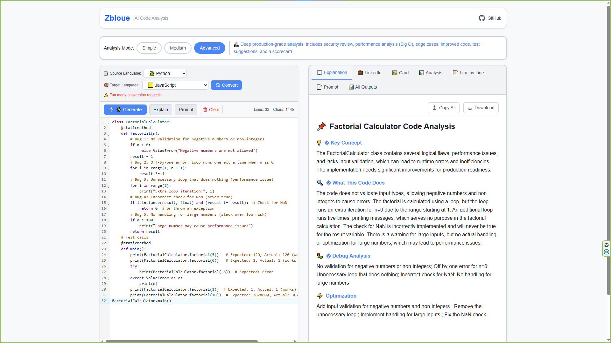
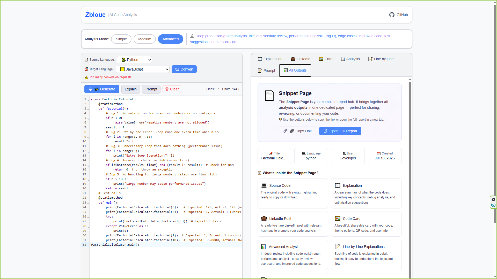
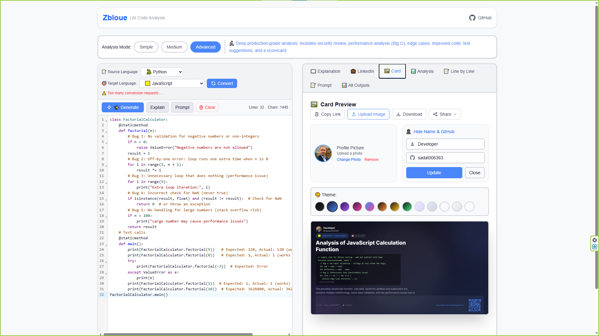
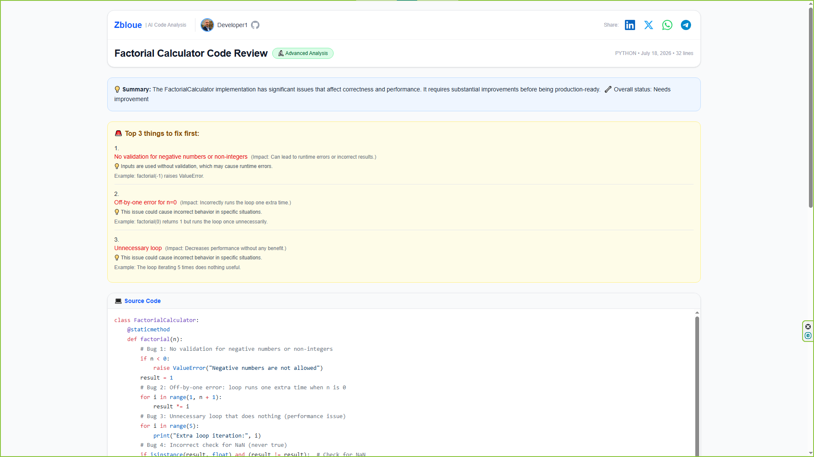

✨ What Is Zbloue?

Zbloue turns raw code into:

- clear explanations
- actionable fixes
- line-by-line insights
- beginner-friendly learning output
- shareable cards and snippet pages

It is built for students and beginner to intermediate developers who want code analysis that feels educational, practical, and easy to understand.

---

## Why I Built It

Many beginner developers struggle with:

- understanding unfamiliar code
- finding meaningful bugs
- learning from overly technical or dry analysis
- sharing their progress in a clean way

Zbloue aims to make code analysis more human, more visual, and more useful for learning.

---

## Features

- 🧠 Beginner-friendly code explanations
- 🔍 Three analysis modes
- ⚡ Top actionable fixes
- 📖 Line-by-line insights
- 🐞 Bug detection and improvement suggestions
- 🎨 Shareable result card
- 🌍 Public snippet page
- 🚀 No signup required for the MVP

---

## Screenshots

### 🖊️ Editor


### 📊 Analysis


### 🎴 Shareable Card


### 🔗 Snippet Page


---

## How It Works

1. Paste or write your code in the editor
2. Choose an analysis mode
3. Get a friendly explanation and useful suggestions
4. Share the result as a card or snippet page

---

## 🌟 What Makes It Different?

- built for learning, not just reviewing
- designed for beginner developers
- clear and explainable output
- visually shareable results
- focused on education and usability

---

## 🛠 Tech Stack

- Next.js
- TypeScript
- Supabase
- AI-powered analysis pipeline

---

## 📌 MVP Status

Zbloue is currently in the MVP stage and actively collecting feedback.

---

## 💬 Feedback I'm Looking For

- Is the analysis easy to understand for beginners?
- Are the suggested fixes useful and actionable?
- Does the shareable card feel appealing?
- Are the sections clear and well-structured?
- What would make this more helpful for learning?

---

## 🚀 Local Setup
```bash
git clone https://github.com/sadat006363/zbloue.git
cd zbloue
npm install
npm run dev
